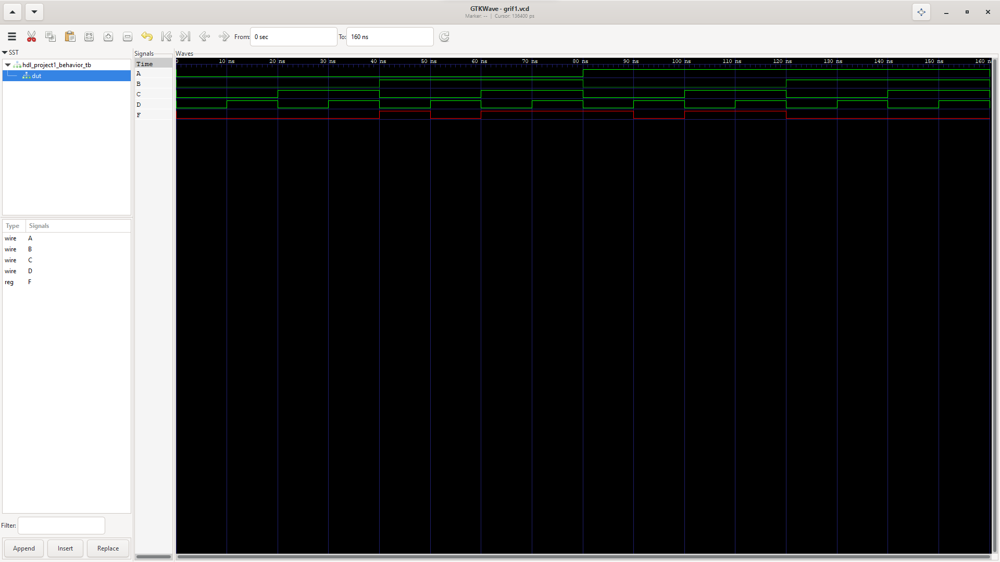

<h1 align="center">
CSARCH HDL Project 1

(Introduction to Computer Organization and Architecture 1)

</h1>

📝**About**:   
   - iVerilog behavioral model HDL program using the function *F = (AB' + A'B)(C + D')*

💻**To run**:

   - Install GNU Fortran compiler, compile, then run (linux-based OS dependent).
